# SampleMERNwithMicroservices
Deploying a MERN (MongoDB, Express.js, React, Node.js) application using Azure Kubernetes Service (AKS) involves several steps.

## Prerequisites
1. Azure Account: Ensure you have an Azure account.
2. Azure CLI: Install the Azure CLI.
3. kubectl: Install kubectl for managing Kubernetes clusters.
4. Docker: Install Docker for containerizing the application.
5. Git: Install Git for version control.

## Step 1: Clone the Git Repository
```bash
git clone https://github.com/UnpredictablePrashant/SampleMERNwithMicroservices.git
```

## Step 2: Create Dockerfile for Frontend and backend microservices

- Dockerfile for Hello Service
```Dockerfile
FROM node:18

WORKDIR /app

COPY package*.json ./

RUN npm install

COPY . .

EXPOSE 3001

CMD ["node", "index.js"]

```

- Dockerfile for Profile Service
```Dockerfile
FROM node:20

WORKDIR /app

COPY package*.json ./

RUN npm install

COPY . .

EXPOSE 3002

CMD ["node", "index.js"]

```

- Dockerfile for Frontend
```Dockerfile
FROM node:18

WORKDIR /app

COPY package*.json ./

RUN npm install

COPY . .

EXPOSE 3000

CMD ["npm", "start"]

```

## Step 3: Create Docker images and pushed into dockerhub
```bash
docker build -t profilebackend:latets .
docker build -t hellobackend:latest .
docker build -t samplefrontend:latest .

docker tag profilebackend:latets kaverigojare/samplemernwithmicroservicesbackendprofile:latest
docker tag hellobackend:latest kaverigojare/samplemernwithmicroservicesbackendhello:latest
docker tag samplefrontend:latest kaverigojare/samplemernwithmicroservicesfrontend:latest

 docker push kaverigojare/samplemernwithmicroservicesbackendprofile:latest
 docker push kaverigojare/samplemernwithmicroservicesbackendhello:latest
 docker push kaverigojare/samplemernwithmicroservicesfrontend:latest

```

## Step 4: Open Terminal and Login
```bash
az login
```

## Step 5: Create Resource Group and Register Resource Provider
```
Microsoft.Compute
Microsoft.ContainerInstance
Microsoft.ContainerRegistry
Microsoft.ContainerService
Microsoft.Kubernetes
Microsoft.KubernetesConfiguration
Microsoft.KubernetesRuntime
microsoft.insights
```

## Step 6: Create AKS Cluster
```bash
az aks create --resource-group SampleMERN --name mern-micro-cluster --node-count 2 --enable-addons monitoring --generate-ssh-keys


```

## Step 7: Kubectl command enable
```bash
az aks get-credentials --resource-group SampleMERN --name mern-micro-cluster
```

## Step 8: Install NGINX Ingress Controller
```bash
kubectl apply -f https://raw.githubusercontent.com/kubernetes/ingress-nginx/main/deploy/static/provider/cloud/deploy.yaml

```
## Step 9: Run Deployment, services as manifest file and Ingress file
```bash
kubectl apply -f ./manifest.yaml
kubectl apply -f ./ingress.yaml
```
## Step 10: Verify Ingress, Deployment, services
```bash
kubectl get ingress
kubectl get pod
kubectl get svc
```

## Step 11: Update DNS A Records
```text
NAME               CLASS   HOSTS                                                        ADDRESS         PORTS   AGE
services-ingress   nginx   hello.cloudcrypto.in,profile.cloudcrypto.in,cloudcrypto.in   20.235.233.24   80      89m

#COPY IP FROM GET INGRESS COMMAND 
```

## Step 12: Deployment Done With AKS

## Screenshot


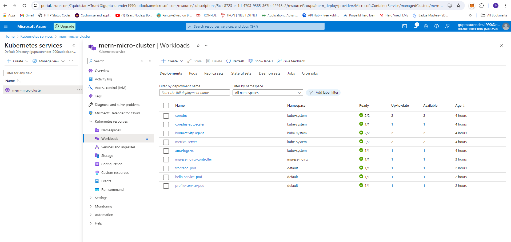

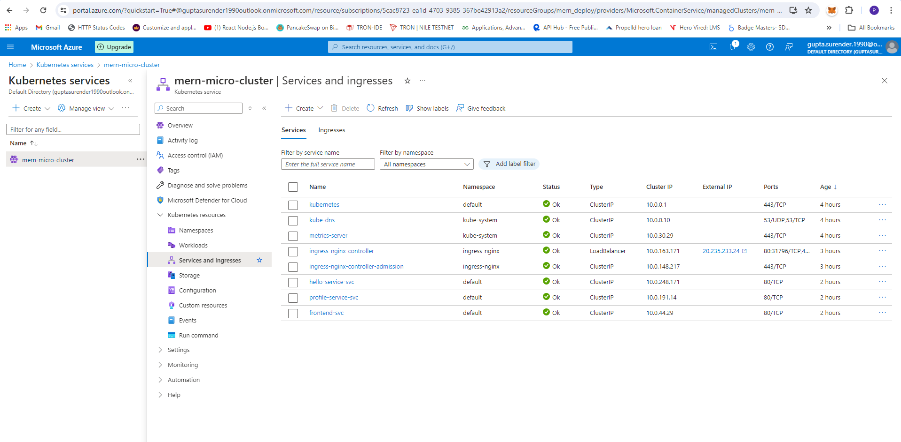

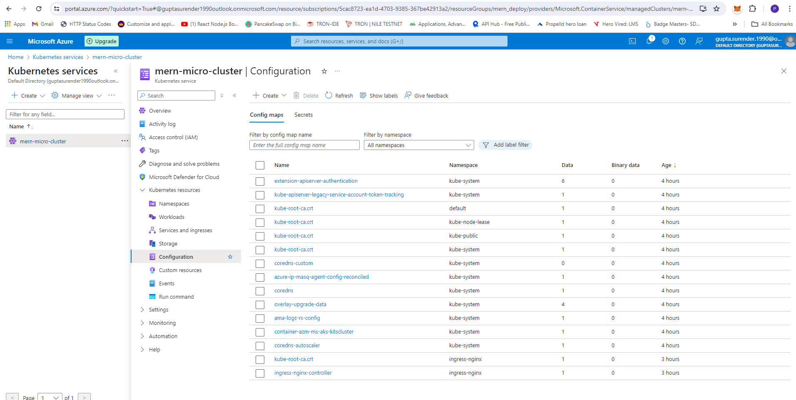

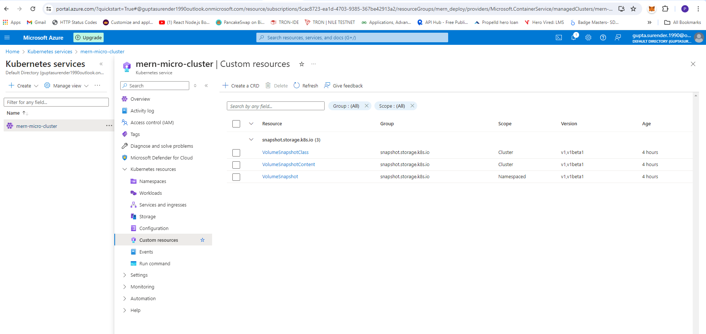

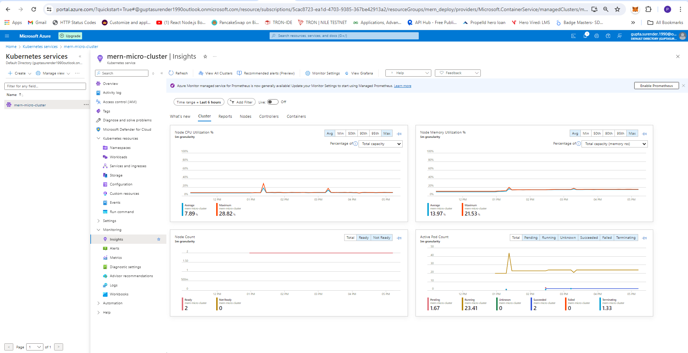

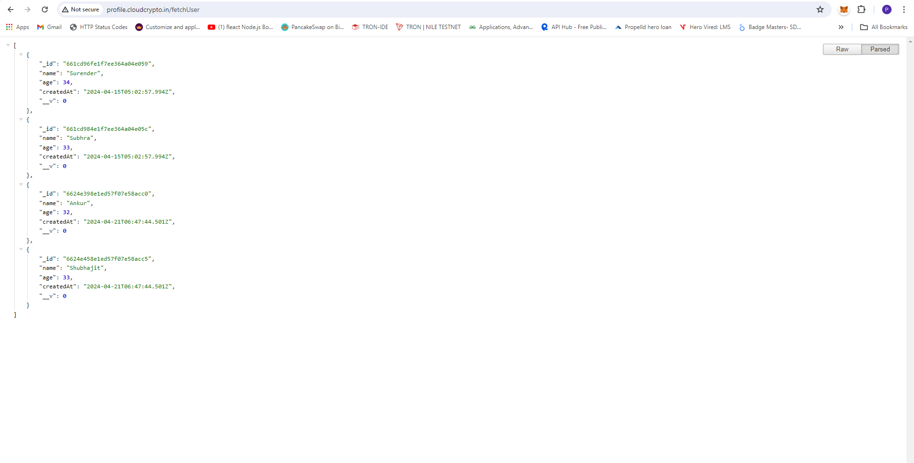

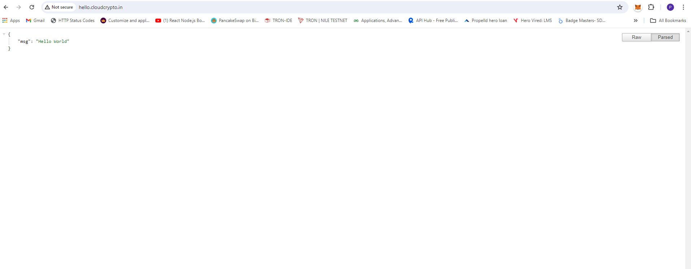

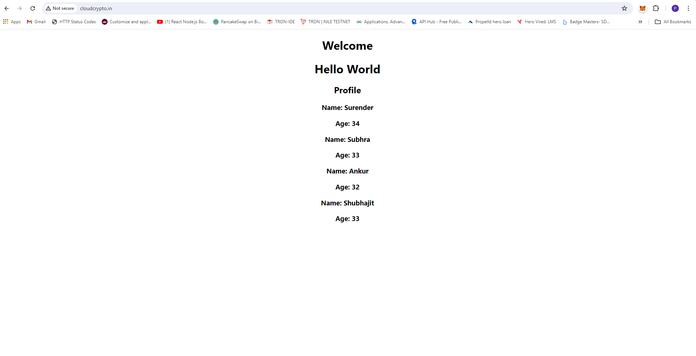

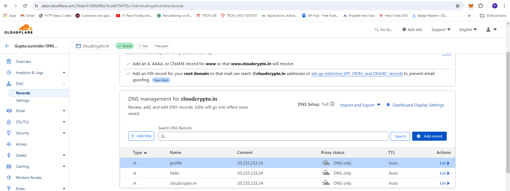

---
---

# Project Teardown Guide
This guide provides the steps to delete all resources created for the project on Azure, including deployments, services, and the Azure Kubernetes Service (AKS) cluster.

## Prerequisites

- Azure CLI installed
- Access to the Azure account with necessary permissions
- `kubectl` configured to interact with the AKS cluster

## Step-by-Step Instructions

### Step 1: Delete Kubernetes Deployments

First, delete the Kubernetes deployments for the services:

```bash
kubectl delete deployment hello-service-pod
kubectl delete deployment profile-service-pod
kubectl delete deployment frontend-pod
```
### Step 2: Delete Kubernetes Services

Next, delete the Kubernetes services associated with the deployments:

```bash
kubectl delete service hello-service-svc
kubectl delete service profile-service-svc
kubectl delete service frontend-svc
```

### Step 3: Verify Deletion

To ensure that all deployments and services have been deleted, you can list the remaining deployments and services:

```bash
kubectl get deployments
kubectl get services
kubectl get ingress
```

### Step 4: Delete the AKS Cluster
Now, delete the AKS cluster. Replace <resource-group-name> and <aks-cluster-name> with the appropriate values.

```bash
az aks list --output table
az aks delete --resource-group mern_deploy --name mern-micro-cluster --yes --no-wait

```

### Step 5: Verify AKS Cluster Deletion

```bash
az aks list --output table

```

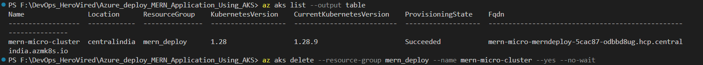

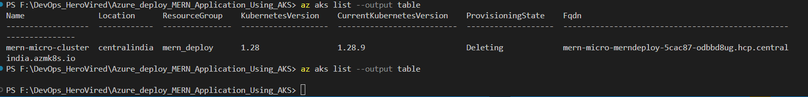
